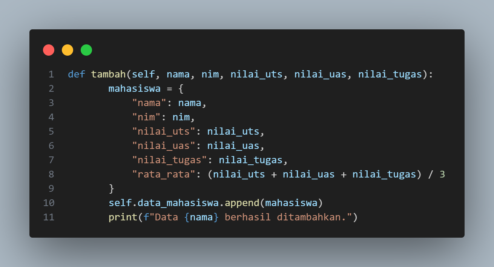

# TUGAS PRAKTIKUM 8

## Step 1 : Deklarasi Class

* class: Membuat sebuah class bernama DaftarNilaiMahasiswa.
* Class ini adalah tempat untuk mendefinisikan atribut (data) dan method (fungsi) yang akan digunakan untuk mengelola daftar nilai mahasiswa.

## Step 2 : Konstruktor (__init__)

* __init__: Fungsi yang dipanggil otomatis saat objek class dibuat.
* self: Mengacu pada instance dari class tersebut.
* self.data_mahasiswa: Atribut berupa list kosong yang akan digunakan untuk menyimpan data mahasiswa dalam bentuk dictionary.

## Step 3  : Method tambah

Fungsi:
Menambahkan data mahasiswa ke dalam atribut self.data_mahasiswa.
### Penjelasan Baris:
1. def tambah(...): Mendefinisikan fungsi tambah dengan parameter:
    * nama: Nama mahasiswa.
    * nim: Nomor Induk Mahasiswa.
    * nilai_uts, nilai_uas, nilai_tugas: Nilai akademik mahasiswa.
2. Membuat dictionary mahasiswa:
rata_rata: Dihitung menggunakan rumus:

## Step 4 : Method tampilkan

Fungsi:
Menampilkan semua data mahasiswa dalam bentuk tabel.
### Penjelasan Baris:
1. Cek data kosong:

* Jika self.data_mahasiswa kosong, tampilkan pesan dan keluar dari fungsi.

2. Header Tabel :

* Mengatur format kolom dengan lebar tertentu menggunakan string formatting.

3. Menampilkan setiap data :

* Menggunakan loop untuk menampilkan setiap data di list self.data_mahasiswa.
* enumerate: Memberikan nomor urut pada setiap data.

## Step 5 : Method hapus

Fungsi:
Menghapus data mahasiswa berdasarkan nama.
### Penjelasan Baris :
1. Loop mencari nama:

* Loop untuk mencari data mahasiswa dengan nama sesuai input.

2. Menghapus data ;

* Jika ditemukan, data dihapus dari list self.data_mahasiswa.

3. Jika tidak ditemukan :

* Menampilkan pesan error jika nama tidak ditemukan.

## Step 6 : Method ubah

Fungsi:
Mengubah data mahasiswa berdasarkan nama.
### Penjelasan Baris :
1. Loop mencari nama

* Loop untuk mencari data mahasiswa dengan nama sesuai input.

2. Mengupdate data :

* Meminta input baru untuk data mahasiswa.
* Mengupdate nilai rata-rata.

3. Jika tidak di temukan :

## Step 7 : Menu Interaktif

Penjelasan:
1. while True: Program berjalan terus sampai pengguna memilih keluar.
2. Menu: Menampilkan pilihan yang bisa dipilih pengguna.
3. Input pengguna:
    * Memilih menu dengan angka.
    * Setiap angka memanggil method yang sesuai:
        1: tambah
        2: tampilkan
        3: hapus
        4: ubah
        5: Keluar program dengan break.

# Hasil Output

## 1. Menambahkan Data Mahasiswa :

### Contoh Input :

### Output :

* Penjelasan:
  Program berhasil menambahkan data mahasiswa "Budi" beserta NIM dan nilai akademiknya ke dalam list self.data_mahasiswa. Selain itu, nilai rata-rata dihitung dan disimpan di dalam data tersebut.

## 2. Menampilkan Daftar Mahasiswa :

### Contoh Input :

### Hasil Output :

* Penjelasan:
Program menampilkan daftar mahasiswa yang sudah dimasukkan ke dalam self.data_mahasiswa.
Tabel berisi:
    * No: Nomor urut.
    * Nama: Nama mahasiswa.
    * NIM: Nomor Induk Mahasiswa.
    * UTS, UAS, Tugas: Nilai yang dimasukkan.
    * Rata-rata: Rata-rata dari nilai UTS, UAS, dan Tugas.

## 3. Mengubah Data Mahasiswa

## Contoh Input :

## Output :

* Penjelasan:
    * Data "Budi" ditemukan, dan program menampilkan data lama.
    * Program kemudian meminta input baru untuk NIM, nilai UTS, nilai UAS, dan nilai tugas.
    * Program menghitung ulang nilai rata-rata dan memperbarui data mahasiswa.
    * Pesan konfirmasi bahwa data berhasil diubah ditampilkan

## 4. Menghapus Data Mahasiswa

### Contoh Input :

### Hasil Output :

* Penjelasan:
    * Program mencari data mahasiswa dengan nama "Budi".
    * Jika ditemukan, data tersebut dihapus dari list self.data_mahasiswa.
    * Pesan konfirmasi bahwa data berhasil dihapus ditampilkan.

## 5. Menampilkan Daftar Nilai Setelah Penghapusan :

### Contoh Input :

### Hasil Output :

* Penjelasan:
  Setelah penghapusan data mahasiswa "Budi", ketika memilih untuk menampilkan data, list self.data_mahasiswa sudah kosong, sehingga tidak ada data yang ditampilkan. Pesan "Daftar Nilai Mahasiswa:" akan tetap muncul, namun tabel akan kosong.

## 6. Menghapus data yang Tidak Ada

### Contoh Input :

### Hasil Output :

* Penjelasan:
  Program tidak menemukan data mahasiswa dengan nama "Rina" dalam list self.data_mahasiswa. Maka program menampilkan pesan bahwa data dengan nama tersebut tidak ditemukan.

## 7. Keluar Dari Program

### Contoh Input :

### Contoh Output :

* Penjelasan:
  Ketika memilih opsi 5 (Keluar), program berhenti dengan pesan "Program selesai.", dan loop while dihentikan dengan break.

# FLOWCHART Daftar Nilai Mahasiswa

Program ini adalah aplikasi sederhana berbasis Python yang digunakan untuk mengelola daftar nilai mahasiswa. Program ini menggunakan konsep Object-Oriented Programming (OOP) dengan memanfaatkan class dan method.

# Diagram Class

Pada gambar menampilkan sebuah class dari code program daftarnilaimahasiswa, dengan adanya diagram class ini kita mampu melihat mana saja diagram class atau tipe class yang terdapat pada code program ini :

init()
tambah(nama: str, nim: int, gender: str, nilai: int)
tampilkan()
hapus(nama: str)
ubah(nama: str, nim: int, gender: str, nilai: int)
menu_interaktif()